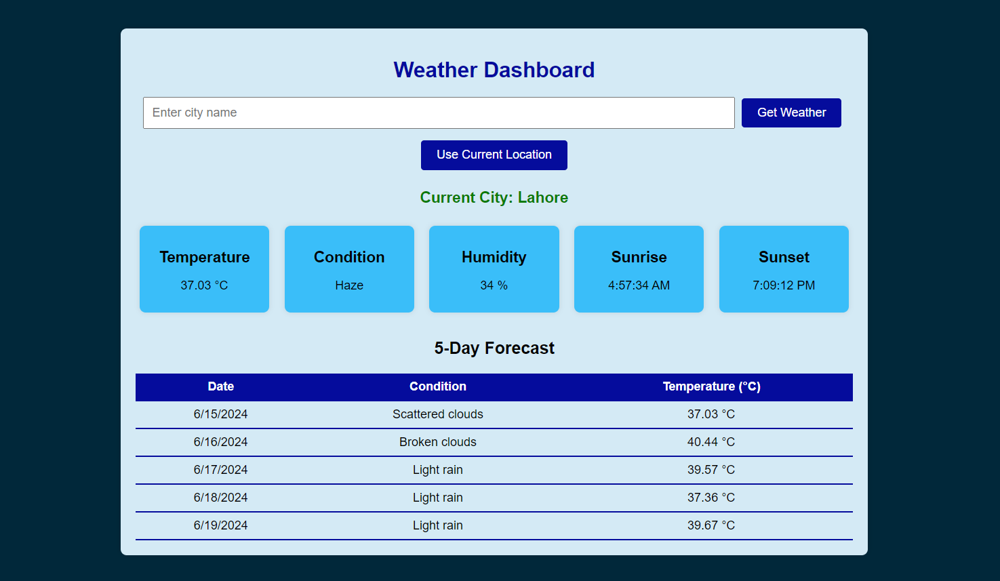

# Weather Dashboard

A weather dashboard that allows users to quickly check the current weather conditions, as well as the 5-day forecast, for a specified location. The dashboard utilizes the OpenWeatherMap API to fetch real-time weather data and present it in an easy-to-understand and visually appealing manner.



## Features

- Current weather details including temperature, condition, humidity, sunrise, and sunset times.
- 5-day weather forecast displayed in a professional grid table format.
- Geolocation to get weather based on the user's current location.
- Responsive design with a modern UI.

## Demo

You can view the live demo of the Weather Dashboard [here](https://your-username.github.io/weather-dashboard).

## Getting Started

### Prerequisites

- You need an API key from [OpenWeatherMap](https://openweathermap.org/api).

### Installation

1. Clone the repository:
    ```bash
    git clone https://github.com/UmerGhaus/weather-dashboard.git
    ```
2. Navigate to the project directory:
    ```bash
    cd weather-dashboard
    ```
3. Open `index.html` in your preferred web browser.

### Usage

1. Enter the name of the city in the input field and click "Get Weather" to fetch the current weather and 5-day forecast.
2. Alternatively, click "Use Current Location" to get the weather data for your current location using geolocation.

### Configuration

1. Replace `YOUR_API_KEY` in `script.js` with your OpenWeatherMap API key:
    ```javascript
    const API_KEY = 'YOUR_API_KEY';
    ```

### Files

- `index.html` - The main HTML file.
- `styles.css` - The CSS file for styling the dashboard.
- `script.js` - The JavaScript file for fetching data from the API and updating the UI.
- `README.md` - This file.
- `screenshot.png` - Screenshot of the Weather Dashboard.

## License

This project is licensed under the MIT License - see the [LICENSE](LICENSE) file for details.
